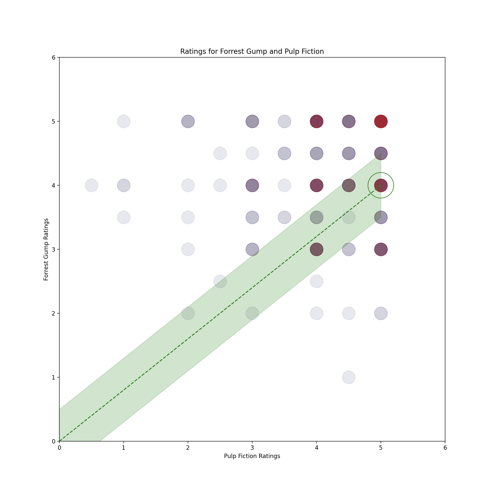

<h1 align="center">
	Recommender Algorythm using K-Nearest Neighbour Cosign Similarity method
</h1>

 

# Types of similarity measurements

- Euclidean Similarity
- Pearson Correlation
- Cosine Similarity

 

# The dataset

MovieLens
20000 Movies
100000 User Ratings

 

# Utility Matrix

## Two-Dimentional

If the user has given a rating for the third movie "Body Parts", points are blue, otherwise red.

 

## Milti-Dimentional

 

# Similarity Matrix

[400 rows]
[400 cols]

The problem with the similarity martix is that we have assumed that absent ratings are 0. To fix this we can use a Centered-Cosign. Normalise the ratings of a given user by subtracting the row mean.

 

# Result

<pre>
Here are some movies like: 'Taxi Driver (1976)'

Title                                               Similarity
Birdcage, The (1996)                                1.0000
Bushwhacked (1995)                                  0.7079
GoldenEye (1995)                                    0.6938
My Family (1995)                                    0.6517
Immortal Beloved (1994)                             0.6362
Flirting With Disaster (1996)                       0.6273
Seven (a.k.a. Se7en) (1995)                         0.6269
Mr. Holland's Opus (1995)                           0.6158
Little Buddha (1993)                                0.6106
</pre>

 
