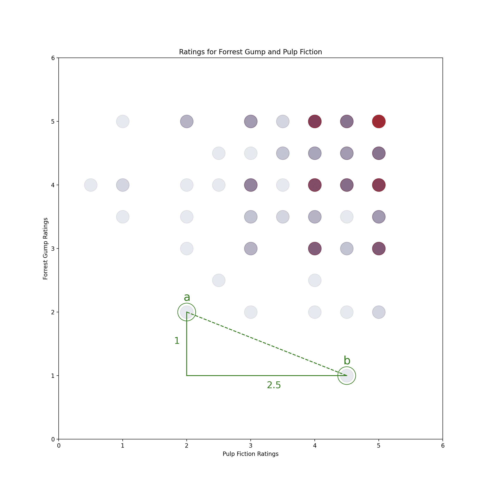
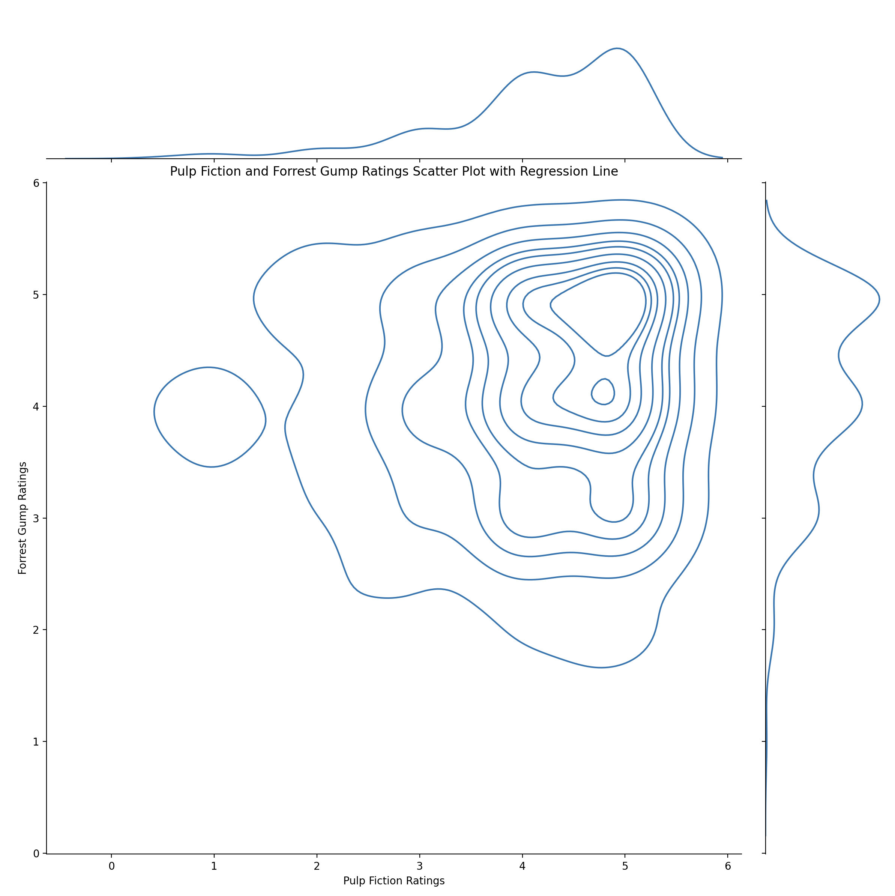

<h1 align="center">
	Recommender Algorythm using K-Nearest Neighbour Cosign Similarity method
</h1>

<br />


This repository contains an implementation of the nearest neighbor algorithm for building a recommender system. The algorithm is based on the k-nearest neighbors approach and is designed to recommend movies to users based on their previous ratings.


- [About Collaborative Filtering](#about-collaborative-filtering)
		- [The Recommendation Problem](#the-recommendation-problem)
		- [Goals of Recommender Systems](#goals-of-recommender-systems)
		- [Collaborative Filtering Approaches](#collaborative-filtering-approaches)
- [Installation](#installation)
- [Nearest Neighbour Algorythm](#nearest-neighbour-algorythm)
	- [The dataset](#the-dataset)
	- [Utility Martix](#utility-martix)
	- [Similarity Calculations](#similarity-calculations)
		- [Cosign Similarity (user-based)](#cosign-similarity-user-based)
		- [Euclidean Similarity (user-based)](#euclidean-similarity-user-based)
		- [Pearson Corrolation (item-based)](#pearson-corrolation-item-based)
	- [Similarity Matrix](#similarity-matrix)
	- [Result](#result)

<br />


# About Collaborative Filtering

### The Recommendation Problem

The recommendation problem can be formulated in two primary models: the prediction version and the ranking version. 

- **Pridiction** In the prediction version, the goal is to predict the rating value for a user-item combination using available training data. This is known as the matrix completion problem, where the missing values are predicted using a learning algorithm. 

- **Ranking** In the ranking version, the goal is to recommend the top-k items for a particular user, and the absolute values of the predicted ratings are not important. The ranking formulation is more common and referred to as the top-k recommendation problem. The solutions to the ranking version can be derived by solving the prediction version for various user-item combinations and then ranking the predictions. However, it is often easier to design methods for solving the ranking version directly.

<br />


### Goals of Recommender Systems

The primary goal of a recommender system is to increase product sales for the merchant.

The operational and technical goals of a recommender system are:

- **Relevance** recommend items that are relevant to the user
- **Novelty** recommend items that the user has not seen before
- **Serendipity** recommend unexpected items that the user might find interesting
- **Diversity** recommend items of different types to reduce the risk of the user not liking any of them

Recommender systems can also help improve user satisfaction, increase user loyalty, and provide insights for further customization.

<br />


### Collaborative Filtering Approaches

Two types of collaborative filtering methods: memory-based and model-based.

- **Memory-based methods (neighborhood-based collaborative filtering):**
Predict the ratings of user-item combinations based on their neighborhoods, which can be defined in one of two ways:

	- User-based: Similar users' ratings are used to make recommendations for a target user A. Predicted ratings of A are computed as the weighted average values of peer group ratings for each item.
	- Item-based: To make recommendations for an item, the first step is to determine a set of similar items. The ratings of a particular user for the items in the set are determined. The weighted average of these ratings is used to predict the rating of the user for the item.

	Advantages of memory-based methods: Simple to implement and resulting recommendations are easy to explain. Disadvantages of memory-based methods: Do not work well with sparse matrices and lack full coverage of rating predictions.

- **Model-based methods:** 
	Use machine learning and data mining methods in the context of predictive models. Parameters of model-based methods are learned within an optimization framework. Model-based methods have a high level of coverage even for sparse ratings matrices.

<br />


# Installation

To use the algorithm, you will need to have Python installed on your system. You can download Python from the official website.

You will also need to install the following packages:

- pandas
- numpy
- scikit-learn

You can install these packages using pip, by running the following command:

```bash
python3 -m pip install <package>
```

<br />


# Nearest Neighbour Algorythm

The algorythm is a study of different methods of collaborative filltering within recommender stystems.

1. Data merged into the Utility Maxrix or _"Feature Space"_.

2. Similarity calculations are compared.
   
3. A K-Nearest Neighbour algorythm recommends a list of movies for a target user.

<br />


## The dataset

MovieLens
20000 Movies
100000 User Ratings

- links.csv
- movies.csv
- ratings.csv
- tags.csv

<br />


## Utility Martix

Neighborhood-based methods for making recommendations involve using user-user or item-item similarity to predict ratings from a ratings matrix. The approach involves finding similar users or items in order to make predictions for specific user-item combinations.


<br />


## Similarity Calculations

### Cosign Similarity (user-based)

If the user has given a rating for the third movie "Body Parts", points are blue, otherwise red.

$$\cos(\mathbf{a},\mathbf{b}) = \frac{\mathbf{a} \cdot \mathbf{b}}{\|\mathbf{a}\| \|\mathbf{b}\|}$$

Consider the table below, with ratings 0 - 10:

|  | **i1** | **i2** | **i3** | **i4** | **i5** | **i6** |
| --- | --- | --- | --- | --- | --- | --- |
| **u1** | 7 | 6 | 7 | 4 | 5 | 4 |
| **u1** | 6 | 7 | ? | 4 | 3 | 4 |
| **u1** | <span style="color:red"> **?** </span> | 3 | 3 | 1 | 1 | ? |
| **u1** | 1 | 2 | 2 | 3 | 3 | 4 |
| **u1** | 1 | ? | 1 | 2 | 3 | 3 |

<br />


The first step is to compute the similarity between user 3 and all the other users. Cosign (1, 3) is calculated as:

$$
\cos(1,3) = \frac{6 \cdot 3 + 7 \cdot 3 + 4 \cdot 1 + 5 \cdot 1}{\sqrt{62 + 72 + 42 + 52} \cdot \sqrt{3^2 + 3^2 + 1^2 + 1^2}} = 0.956
$$


<br />


### Euclidean Similarity (user-based)

$$
distance = √(1² + 2.5²) = 0.4
$$

$$
similarity = 1/(1 + 0.4) = 0.714
$$



<br />


### Pearson Corrolation (user-based)

Define positive and negative corolations

$$r_{\mathbf{a},\mathbf{b}} = \frac{\sum_{i=1}^n (a_i - \bar{a})(b_i - \bar{b})}{\sqrt{\sum_{i=1}^n (a_i - \bar{a})^2} \sqrt{\sum_{i=1}^n (b_i - \bar{b})^2}}$$



<br />


## Similarity Matrix

[400 rows]
[400 cols]

The problem with the similarity martix is that we have assumed that absent ratings are 0. To fix this we can use a Centered-Cosign. Normalise the ratings of a given user by subtracting the row mean.


<br />


## Pridict User Rating

$$ \hat{r}_ {uj} = \mu_u + \frac{\sum_{v\in Pu(j)} \text{Sim}(u,v) \cdot s_{vj}}{\sum_{v\in Pu(j)} |\text{Sim}(u,v)|} $$

where $\hat{r}_ {uj}$ is the predicted rating of target user u for item j, $\mu_u$ is the mean rating of user u, $s_{vj}$ is the mean-centered rating of user v for item j, $\text{Sim}(u,v)$ is the Pearson correlation coefficient between user u and user v, and $Pu(j)$ is the set of k closest users to target user u, who have specified ratings for item j (Aggarwal, 2016, p. 36).

<br />


## Recommend Movies to User (K-Nearest Neighbour)

The program takes a user ID, ranging from 1 - 600.
It produces a list of the top k = 10 recommended movies.

<br />


Simalarity to u3:

|  | **S u3** |
| --- | --- |
| **u1** | 0.894 |
| **u2** | 0.939 |
| **u3** | 1.0 |
| **u4** | -1.0 |
| **u5** | -0.817 |


<br />


<pre>
Here are some movies like: 'Taxi Driver (1976)'

Title                                               Similarity
Birdcage, The (1996)                                1.0000
Bushwhacked (1995)                                  0.7079
GoldenEye (1995)                                    0.6938
My Family (1995)                                    0.6517
Immortal Beloved (1994)                             0.6362
Flirting With Disaster (1996)                       0.6273
Seven (a.k.a. Se7en) (1995)                         0.6269
Mr. Holland's Opus (1995)                           0.6158
Little Buddha (1993)                                0.6106
</pre>

<br />


# Citations

Aggarwal, C. C. (2016). Recommender systems: The textbook. Springer International Publishing.